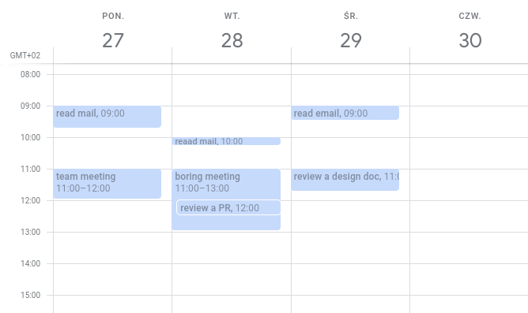

# `calendar-stats`, a program to compute statistics from Google calendars.

## Summary

If you keep track of what you spend your time on by creating events in a Google
Calendar, this program can help you compute some statistics based on those
events, as long as you adhere to some conventions.

## Features

### Time range selection

By default the program looks at events that start before the beginning of the
current week, and end before now.

You can change the start week by setting the `-weeks` parameter.

You can set arbitrary start or end by setting the `-start` or `-end` parameters
to unambiguous values in formats understood by the [dateparse
library](https://github.com/araddon/dateparse).

Note that events that begin before the start or finish after the end are not
taken into account, even if they partially run into the selected time frame.
This may change in the future.

### Time spent per day

The program will count and print how much time overall the events took, per day.

When run against a calendar like the following:



It will produce the output such as the following:
```
$ ./calendar-stats
[...]
Time spent per day:
2023-03-27: 1h45m0s
2023-03-28: 2h15m0s
2023-03-29: 1h15m0s
```

Note that it accounts correctly for overlapping events.

### Time spent per category

If you provide a configuration file which explains how to group events into
categories, the program will also count how much time was spent on each category.
In case of overlapping events, the time is accounted proportionally.

With the above calendar and the following config file:

```yaml
categories:
- name: mail
  match:
  - re: "read e?mail"

- name: meetings
  match:
  - re: "meeting"

- name: reviews
  match:
  - re: "^review:? "
```

The output will be:

```
$ ./calendar-stats
[...]
Time spent per category:
23.8% mail
52.4% meetings
19.0% reviews
Unrecognized:
2023-03-28T10:00:00+02:00      15m0s  reaad mail
```

The program will also list unrecognized events, i.e. events that do not match
any category.

### Event summary corrections

1. Optionally, the program can save unrecognized events into a corrections
   file.
2. The user can then change the summary (title) of the events in this file
   using a text editor.
3. On subsequent invocation, the program will update event summaries in the
   calendar based on the edited file.

This is a faster way to retitle multiple events than edit them one by one in
the Google Calendar interface directly.

Taking the above calendar as an example, the "reaad mail" event summary
contains a typo.  Running the program with option `--corrections
corrections.yaml`, the following file will be created:

```yaml
corrections:
    - id: 2lb6peh9kscthpiaen2jidjemj
      summary: reaad mail
      organizer: Marcin Owsiany
```

We use a text editor to fix the `summary:` line and run the program again:

```
$ ./calendar-stats -weeks 5 --corrections corrections.yaml 
2023/04/15 10:23:20 Updating summary of 1 events...
2023/04/15 10:23:22 Summaries updated.
Time spent per day:
2023-03-27: 1h45m0s
2023-03-28: 2h15m0s
2023-03-29: 1h15m0s
Time spent per category:
28.6% mail
52.4% meetings
19.0% reviews
```

The summary was updated in Google Calendar, and subsequently all events are recognized.
The resulting corrections file is now nearly empty:

```yaml
corrections: []
```

## How to run the program

`go build && ./calendar-stats -decimal-output=true -weeks 159 -source 5usct2veeabp9unuefaojgif88@group.calendar.google.com` is what worked great during 2023 Vorstandssitzung of 35services.

You can build your own binary by running `go build .` in the top directory.

From time to time, binaries may be provided in the GitHub [releases](https://github.com/porridge/calendar-stats/releases).

Either way, in order to actually authenticate against Google Calendar API, the program
needs a `credentials.json` file, which represents an OAuth2 Client. See [instructions
for generating a client](https://developers.google.com/calendar/api/quickstart/go)
for a desktop application.

Once you save it in the current directory, the program will authenticate you to Google Calendar
using a web browser and save a `token.json` file on the first invocation.

See above for examples and use the `-h` parameter to see available options.
